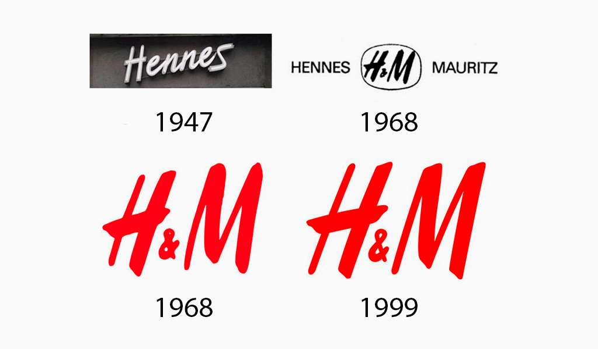

**Type is the new black...**

H&M is one of the most successful global fashion and design clothing brands in the world, and it has been for 74 years now. With over 5000 stores all around the globe, the retail store is known for being reliable, cost efficient and trendy. The H&M logo is almost instantly recognized, whether you are walking down the Highstreet, in a shopping centre or online shopping, their logo makes it hard for you to walk past without looking. They have faced a journey to get to the famous ‘H&M’ logo we all know and love today….so let’s take a deeper look.

H&M was originally named ‘Hennes’ which is a Swedish word, translating to ‘Hers’ in English. As you can see the logo is slightly on a slant and has a handwritten, authentic feel to it. This logo is very approachable and friendly; however, it was very basic and presented a ‘girl next door’ feel…nice, but nothing…special or unique.

In 1968 Hennes (H&M) merged with Mauritz Widforss, this then formed their new logo ‘Hennes & Mauritz’ which was designed using an sans-serif typeface. The two names are separated by the new ‘H&M’ monogram, which was placed in a circular frame in the middle of the two names. This logo design was very short-lived as they created a new logo design just a few months later…and this one was iconic.

The logo was redesigned to a big bright red monogram, this had the same typeface and idea as the previous but without the framing. Considering the logo doesn’t say much, it was important for the designers to put intricate detail into the font and the colour of the logo. The smooth, paint like strokes of the logo create a welcoming feel, this combined with the striking bold red colour reflects the style, power, and passion of the brand. This is attractive to H&Ms target audience, which according to the company is usually those under the age of 30. The new and improved H&M logo was vivid and modern, which draws their intended audience’s attention in, the logo stayed the same until 1999.

In 1999 the logo wasn’t necessarily rebranded, it was redefined, the colour changed from a vibrant, bold red to a slightly darker shade, even though the change was very subtle, it gave the company a more serious and luxurious feel. The letters were also modified, they straightened the lines more which made them longer and more distinct, making the logo more eye-catching.