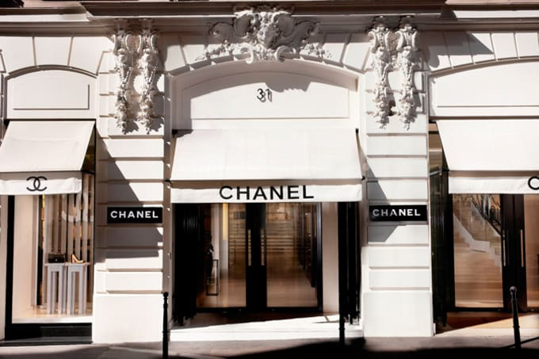
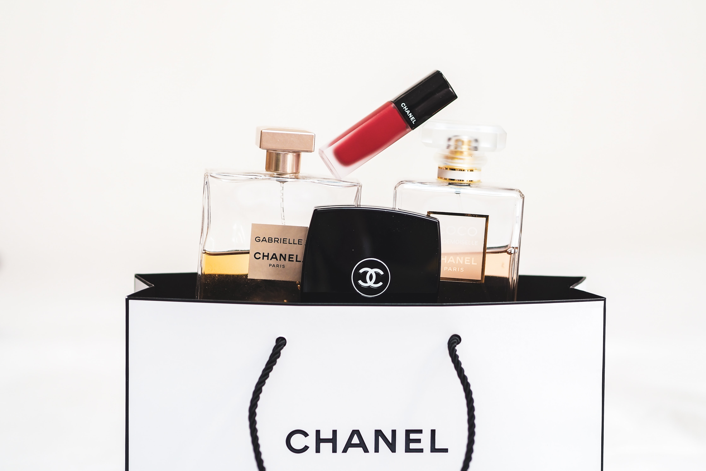

*"A girl should be two things: classy and fabulous"*

## **Discover Chanel**

Chanel is one of the most luxurious and elegant designer brands in the whole world, it is highly respected and admired by many people. It was founded by Gabrielle Bonheur, also famously known as Coco Chanel, Chanel is known for their wide range of fragrances, jewellery, fashion, and of course the famous ‘little black dress’. The company originated in Paris, France, it is now located all over the globe with 310 inclusive designer stores. Chanel has an extremely strong and sophisticated brand representation which is appealing to their current target market, who enjoy luxury items and usually have a high repeat purchase rate.

The Chanel branding is in typeface ‘Couture’, belonging to the sans serif font, designed by Chase Babb in 2012, the typeface is very bold yet elegant which suits the brands persona. Chanel uses a theme of black and white colours, this is to emphasise the sophistication of the brand, it also allows customers to recognise the brand. The strong branding is synonymous with quality, style, and elegance- consumers appreciate the brand as well as its craftsmanship and history. Chanel's branding means consumers have great pride when they wear or own a Chanel item, they feel luxurious, fashionable, and attractive…so it’s only right their branding reflects the same thing right?

Chanel also has a very famous logo which was created in 1925, the logo is made up of two mirrored and intertwined ‘C’s, this of course representing and is actually designed by the founder Ms Coco Chanel. The purpose of the logo is to present the elegance of Chanel as a brand, as Coco Chanel said, ‘Simplicity is the keynote of all true elegance’. The fact that this logo was designed by Coco herself, shows the authenticity of the brand and how much history and heritage is behind it. Customers admire this about Chanel, they are not buying purely because they have nice items (although it does help;)) they are also buying because of the brand, they want to be a part of Chanel and its history. This logo features on most of the irresistible Chanel bags as well as their jewellery and is a key feature to Chanel’s desirable branding.

Overall, Chanel has used typeface very well in order to compel customers to buy from them, it draws customers back to repurchasing, which means Chanel have a loyal customer base due to the high class, inclusive branding and experience they receive.

