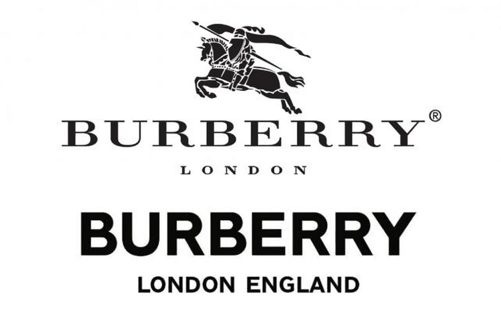
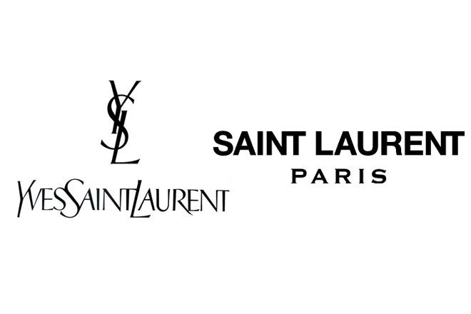
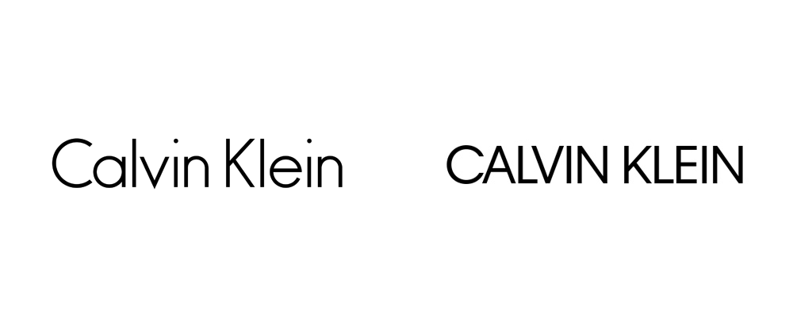

**Burberry**

Burberry logo has been tweaked a handful of times since the original logo was created in 1901, where the ‘Equestrian Knight’ was developed, which was Burberry’s trademark for over 100 years. I am going to be looking at the significant changes from the logo from the 1999 design to the new 2018 design!

As you can see, the original logo (on the top) had slender, delicate letters, airly spaced with officious serifs. The Burberry logo was a bespoke expanded version of Bodoni, a modern serif style, which reflects the brands image of high quality and luxury. However, the thin strokes can make it difficult to read, especially on screens at smaller sizes.

In 2018 this all changed… new creative director Riccardo Tisci hired graphic designer Peter Saville to redesign the new and improved Burberry logo. Saville created a heavier, bold look with a geometric sans-serif font reading ‘Burberry London England” in all caps to give a modern feel to the brand.

Burberry isn’t the only fashion brand to redesign their logo…

**Yves Saint Laurent**

Saint Laurent: an icon to the fashion world, established in 1961, founded by the famous fashion designer Yves Saint Laurent. The Identity of the brand has remained the same over the years until 2012 when their new logo was designed…

The original logo was composed with an elegant logotype with a monogram, formed by the three intertwined letters of the designer’s name ‘YSL’, featuring a monochrome composition. The two were sometimes used together, other times the monogram was placed on cosmetic items or on fashion tags. The logo is in uppercase with the first letters of each part elongated to stand out, executed in a custom sans-serif font. The logo is also placed closely together with little spacing.

In 2012 Hedi Slimane rebranded the YSL after the company was shortened to ‘Saint Laurent’ which is written in bold with the sans serif typeface ‘Neue Helvetica’. The tagline ‘Paris’ is in a modern serif typeface, its letters being spaced apart, adding a sense of elegance and lightness to the new logo. Since the redesign, the company has seen a double-digit year to year growth since 2012.

 **Calvin Klein**

As well as Burberry, Saville redesigned the infamous Calvin Klein logo in 2017. Although the changes were small, they were very effective. Saville swapped the lowercase type for an uppercase type, he also subtly moved the letters closer to one another, keeping its black colour and sans-serif typeface.

There is one thing all these redesigned logos have in common…

They are all written in a sans serif style! Branding specialists give many benefits of using sans serif typefaces for logos, like being cleaner and more legible especially on mobile phones. Of course, it may seem that brands just all look the same now, but people in charge of high fashion brands like Burberry, YSL and Calvin Klein know that a logo doesn’t hugely define them anymore. They have built a name for themselves and that their logos may look the same but what they have to offer is completely different.