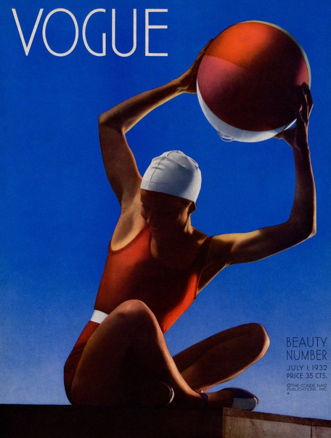
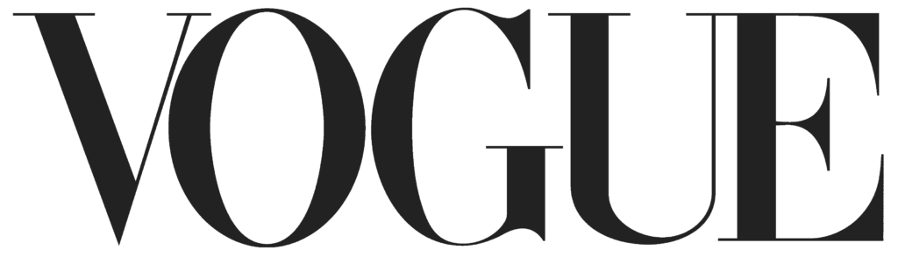

*Fashion dresses you, but who dresses fashion?*

Who loves vogue? From their magazines, their models and the met gala they present every year, they are an absolute icon to us all, and they have been for some time now…

Magazine covers featured very little typography in the early years of the 20th century, there was not a specific typeface a brand would use, they would pick and choose different typefaces. Over time the modern class of typefaces such as Bodoni and Didot with their high contrast between thick and thin strokes came to define typography and were usually paired with high-fashion content.

Vogue is one of the most famous international fashion magazines, they have been publishing since 1892 and now have about 11 million subscribers worldwide! They have a highly established brand which has a high influence over others, it is clear to see that many value Vogues opinion. A huge part of Vogue is its Magazine’s logo, it took some time for the logo to be established and it has advanced in recent years, but its look is still solely based on Didone font styles…. So let’s delve into the past of Vogue and find out more…

## **The History of the Vogue logo**

In 1892, Vogue magazine was first launched as a weekly publication for high society in New York. The title was not confined to a single typeface and each issue featured a hand-lettered logo created by the high society graphic designer. Conde Nast bought vogue magazine in 1909, they made the covers more abstract and colourful.

Through the 1920- 30s hand drawn logos were still very much in the picture. In July 1932, photographer Edward Steichen shot Vogues first ever colour photo cover which featured a minimal white lettered logo and a blue background, however the logo styles were still varied during this time.

A 1947 edition of Vogue features an appearance of the Didot typeface logo, however a taller more compact version of it, Vogue still went back and fourth with their type face choices, changing from serif to sans-serif.

Finally, in 1955 the uppercase, serif, Didot logo stuck with the brand as their permanent logo which we all recognize and know today! The logo is very delicate but strong, with hairline strokes giving it a sense of luxury and uniqueness. The Didot typeface is great for Vogues cover work as the company likes to use different images and colours depending on the seasons and what the ‘in colours’ are at the time to make their covers stand out to their audience

