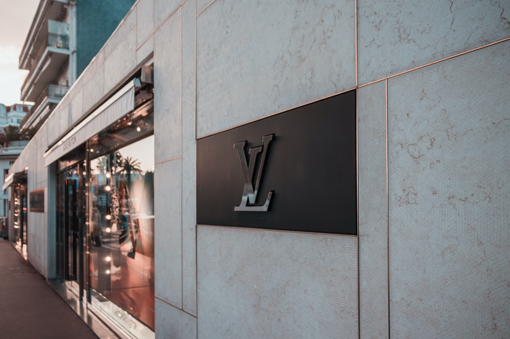
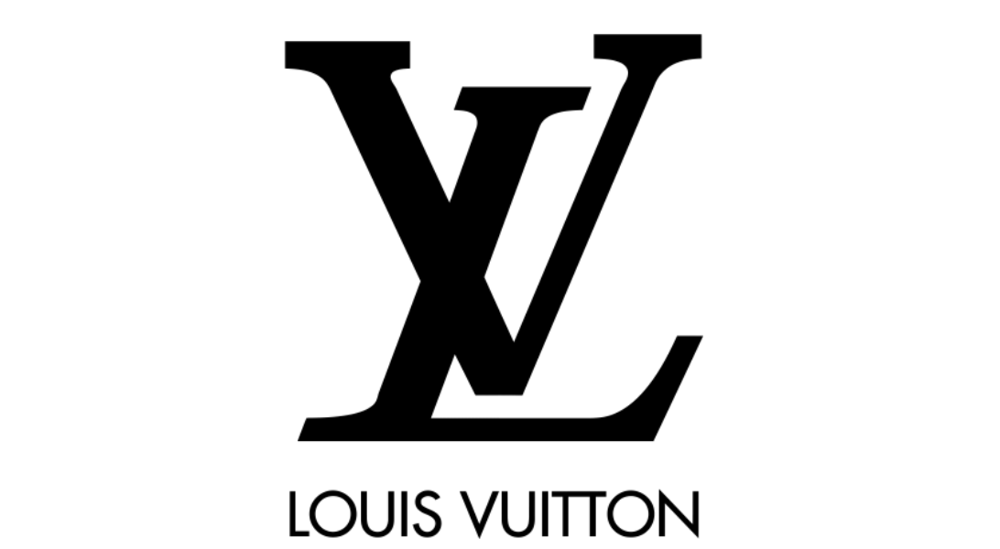
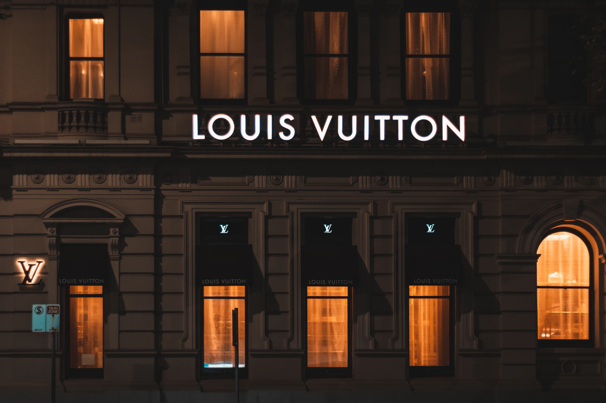

*"You can everything you want in life if you dress for it"*

Louis Vuitton: a luxury lifestyle and fashion brand which was established in 1854 in France by the founder, Louis Vuitton. The company was first known for their production of high quality, durable trunks, today it is one of the most famous and successful fashion-houses of all time! Not only do they still design trunks, but they also design items like clothing, bags, jewellery and footwear for men and women. Louis Vuitton’s identity is seen as elegant, yet bold and is instantly recognized by people all over the world…

Their logo was designed in the 19th century, and it has never been completely re-designed, there were come minor changes to the emblems and for a period they removed the wordmark from the official logo, however these changes never stuck.  The unchanging nature of Louis Vuitton’s logo is what sets it apart from other logos in the fashion industry. Customers who know about the history of the brand see the brands perpetual logo as a signifier of its relevance and dominance of the fashion industry.

The Louis Vuitton logo is used across their products, the status associated with their logo adds extreme value to their items and creates a higher demand from their customers. Within Louis Vuitton’s marketing, their logo is used as their centerpiece for example in the video advert for their perfume ‘Coeur Battant’ with Emma Stone, the brand name is the first thing you see, as well as the emblem in the bottom right corner.

<iframe width="560" height="315" src="https://www.youtube.com/embed/fFv5smPPuZo?rel=0" allow="accelerometer; autoplay; encrypted-media; gyroscope; picture-in-picture" allowfullscreen></iframe>

The success of the brand means that it is one of the most counterfeited companies, almost 20% of the accessories that have been counterfeited in the EU are Louis Vuitton. The company works very hard to reduce the number of fakes and avoid it from happening.

The Louis Vuitton logo comes in two parts, sometimes they are used together however they are also used separately. The whole brands name is placed under the LV monogram is written in uppercase using the sans-serif typeface ‘Futura’ which represents the modern and progressive character of the fashion house. The boldness and spacing is perfectly balanced making it classy and elegant.

The LV monogram is made up of the initials of the founder ‘LV’, the ‘V’ is straight and is overlapped with the ‘L’ which uses the italic type, even though the two are interlocked, the symbol is still legible. The letters are solid and elongated serifs with thick and distinct lines which makes them stand out. This emblem is one of the most famous symbols in the world, representing history and sophistication. The logo usually uses a black and white colour scheme to show classic simplicity, however there are times where other colours are used. On many of the Louis Vuitton bags and purses, a gold, brown colour is used as their classic print which shows the nature of the brand. Sometimes a rainbow colour scheme is used… which is not my personal favourite.

