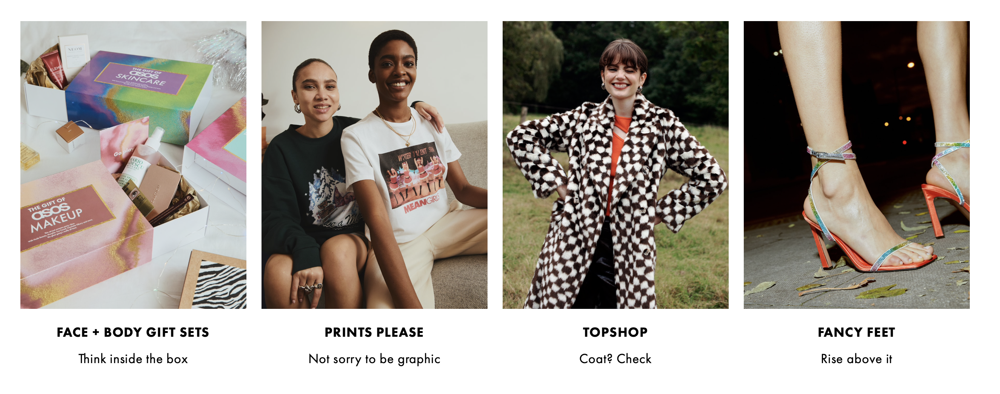
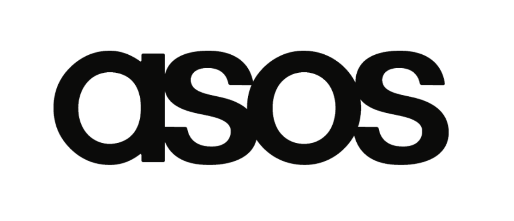

*Fashion With Integrity...*

Brands establish themselves though their aesthetic choices, no matter brand, there is always a designer behind it who intended to make you feel a certain way about the brand. There are multiple factors which come together to create a brands visual unique like colour, font, and layouts. For a brand choosing the right typeface is very important in creating the brands personality, you need to know how to present what you are selling to your customers, just through the logo itself.

ASOS is a British e-commerce platform which was created in 2000, they specialize in the distribution of fashion and cosmetic items all over the world. ASOS follows the latest fashion trends and upload new items everyday making it accessible and enjoyable for their customers to shop regularly. ASOS is a perfect example of a brand choosing their aesthetic choices to ensure that their website is always on brand for their audience. They use a minimalist yet confident approach by using big bold fonts, yet they have a vibrant colour palette in their images to go with this. The brand is perfect for their audience targeted at 18–35-year-olds, who are starting to lean towards sustainability and good quality at an affordable price but not like cheaper fast fashion.

The original ASOS logo was created in 2000 and stayed with the company for 3 years. It featured blue and black lettering, with the full name of the brand “As Seen on Screen” which featured an emblem on the left with a solid black tagline.

ASOS changed its logo in 2003, now the famous logo is extremely recognized within the fashion industry as well as being very respected. Their logotype is executed in all lowercase letters of a bold sans-serif font, which is very close to the Helvetica Family typeface. The letters in the logo are attached together with no spacing to create the sense of a single element. The nameplate is perfectly balanced with smooth lines to evoke a sense of luxury and style. ASOS is a derivative for “As Seen on Screen” this is because when the company was first established, they sold items which were like those seen on celebrities in movies and TV.

ASOS designs and produces several clothing lines under the ASOS brand, they also sell other companies’ products on top of this also. ASOS has a very good reputation and is loved by millions all over the globe for their up-to-date fashion and how accessible they are to all their international shoppers.